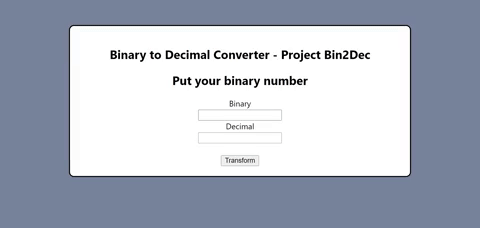

# 07-Bin2Dec
 Binary is the number system all digital computers are based on.
 
 In this repository you could transform binary number into decimal. In the code you can also see when you make a mistake bringing non-binary characters.
 
 
